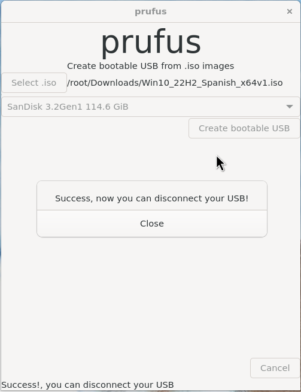
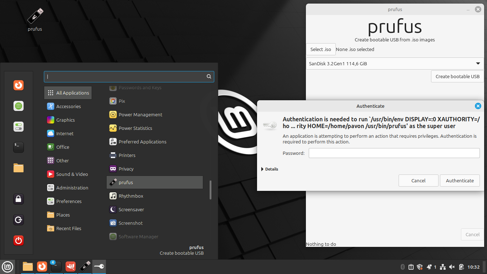

## prufus

[](https://github.com/oscarpavon/prufus/releases/download/v0.001a/prufus_installer.zip)  

You can create a bootable USB with Windows installer from GNU/Linux. And then you can install Windows on another computer. Useful for computer repair people or if you want to go back to Windows from Linux after a disappointment.  
This is an open source project with GPL 3 license. That means you can modify it like you want, change the name or even sell it as long as you distribute with your changes to the source code.  
This program it's for only GNU/Linux

This is the main branch if you want to use the stable version use:  
https://github.com/oscar0pavon/prufus/tree/v0.1
# Dependencies
- GNU/Linux
- make
- gcc
- rsync
- wimlib-imagex (this program divide the big Windows installation file in parts because the restriction of FAT32 filesystem about 4GB per file)
- dosfstools (it's for create the first partition EFI)
- ntfs3g (for creating a second partition for user data and set disk label)


### Runtime dependency
```
sudo apt install wimtools
```
# Build

```
git clone https://github.com/oscarpavon/prufus
cd prufus
make
```

# Install
```
sudo make install
```
This will install the program, the program launcher, the icon and create a ".desktop" in your Desktop

# Distributable
We use an installer for distribute prufus, this installer can install the dependencies for your GNU/Linux distribution
```
make distributable
```
For generate the "prufus_installer.zip"


# Warning
Every command for manipulate disks in GNU/Linux are for privilege user. You don't even can seen your USB without "sudo". And the GUI need "sudo" for format the USB.  
This program only work with GPT partitions tables. Only UEFI is supported and only EFI will be supported.
NONE Windows hack here like remove TPM requirement. And never will be implemented neither.

# How to use

You will see an icon in your desktop. Double click on it and enter your password.  
Select the .iso file and click on "Create bootable USB"
## Terminal
The graphics user interface just call a script who do the real work with two parameters, the .iso path and the device path like "/dev/sdb".
You can use that script directly from you PATH environment variable
Example:
```
sudo prufus.sh ./Downloads/Windows.iso /dev/sdb
```
# Development
If you want code navigation and code completation you can use clangd for your text editor
```
cd source_code
./generate_compile_commands.sh
```
This will generate a "compile_commands.json" file.
You need to open that text file and add the path where you are working like "/home/user/prufus/source_code/" in
```
"directory": ".",
```
replace the dot with the new path  
You can ask in:
[Threads](https://www.threads.net/@oscar0pavon)
